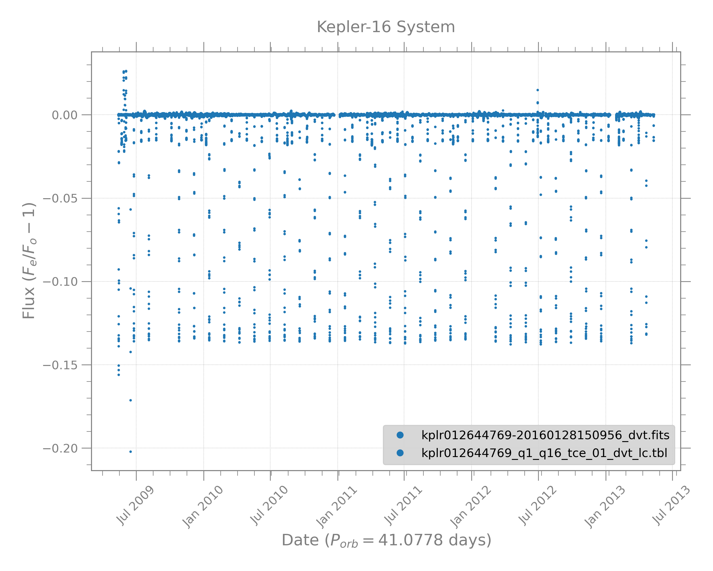

<h1 align="center" margin-top="3em">
  <b>Kepler-16b:</b> The First Circumbinary Planet
</h1>

# Collect the Data

```bash
#!/bin/sh

# If wget is not installed on your system,
# please refer to http://irsa.ipac.caltech.edu/docs/batch_download_help.html.
#
# Windows users: the name of wget may have version number (ie: wget-1.10.2.exe)
# Please rename it to wget in order to successfully run this script
# Also the location of wget executable may need to be added to the PATH environment.
#
wget -O 'kplr012644769-20160128150956_dvt.fits' 'http://exoplanetarchive.ipac.caltech.edu:80/data/ETSS//KeplerDV/005/713/24/kplr012644769-20160128150956_dvt.fits' -a raw_2269.log
wget -O 'kplr012644769_q1_q16_tce_01_dvt_lc.tbl' 'http://exoplanetarchive.ipac.caltech.edu:80/data/ETSS//KeplerDV/000/866/64/kplr012644769_q1_q16_tce_01_dvt_lc.tbl' -a raw_1413.log
```

# Code to Plot Data

```python
from astropy.io import fits, ascii
from astropy.time import Time
import matplotlib.pyplot as plt
from matplotlib.dates import DateFormatter
import pandas as pd


fname = 'kplr012644769-20160128150956_dvt.fits'
hdu = fits.open(fname)
data = hdu[1].data
df = pd.DataFrame({'time': data['TIME'], 'flux': data['LC_INIT']})
df['time'] = Time(df['time'] + 2454833, format='jd').datetime64
plt.plot(df['time'], df['flux'], '.', ms=3, label=fname)

fname = 'kplr012644769_q1_q16_tce_01_dvt_lc.tbl'
data = ascii.read(fname)
df = pd.DataFrame({'time': data['TIME'], 'flux': data['INIT_FLUX_PL']})
df['time'] = Time(df['time'] + 2454833, format='jd').datetime64
plt.plot(df['time'], df['flux'], '.', ms=3, c='C0', label=fname)

plt.title('Kepler-16', size=16)
plt.xlabel(r'Date ($P_{orb}=41.0778$ days)', size=16)
plt.ylabel(r'Flux ($F_e/F_o - 1$)', size=16)

date_form = DateFormatter("%b %Y")
plt.gca().xaxis.set_major_formatter(date_form)

plt.xticks(rotation=45)
plt.grid(ls=':')
plt.legend(markerscale=4)
plt.tight_layout()
plt.savefig('kepler-16.png', dpi=300)
```

# Figure


